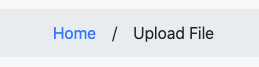

# ActiveStorage File Upload in Rails

## Table of Contents

* [Prerequisites](#prerequisites)
    * [Development Environment Setup](#development-environment-setup)
* [Adding File Uploads](#adding-file-uploads)
    * [Step 1: Clone the GitHub Repo](#step-1-clone-the-github-repo)
    * [Step 2: Switch to the main Branch](#step-2-switch-to-the-main-branch)
    * [Step 3: Install the Ruby Gem Dependencies](#step-3-install-the-ruby-gem-dependencies)
    * [Step 4: Install the JavaScript Dependencies](#step-4-install-the-javascript-dependencies)
    * [Step 5: Initialize the Database](#step-5-initialize-the-database)
    * [Step 6: Run the Development Web Server](#step-6-run-the-development-web-server)
    * [Step 7: Generate the UploadedFile Model](#step-7-generate-the-uploadedfile-model)
    * [Step 8: Attaching ActiveStorage to the UploadedFile Model](#step-8-attaching-activestorage-to-the-uploadedfile-model)
    * [Step 9: Creating the UploadedFiles Controller](#step-9-creating-the-uploadedfiles-controller)
    * [Step 10: Adding Helper Methods](#step-10-adding-helper-methods)
    * [Step 11: Adding Routes](#step-11-adding-routes)
    * [Step 12: Adding Controller Methods](#step-12-adding-controller-methods)
    * [Step 13: Creating and Editing the View Templates](#step-13-creating-and-editing-the-view-templates)
    * [Step 14: Installing Bootstrap](#step-14-installing-bootstrap)
    * [Step 15: Adding Styling](#step-15-adding-styling)

## Prerequisites

### *Development Environment Setup*

Please make sure you have setup your development environment
following [these](https://human-se.github.io/rails-demos-n-deets-2021/demos/development-environment/) instructions.

As a result, you should have the following installed on your development machine:

* Ruby 2.7.2
    * Rails 6+
* Postgres
* Yarn (or npm)

If the above is all installed and working properly, you are ready to move to the next step.

## Adding File Uploads

### Step 1: Clone the GitHub Repo

First, clone the base repository located like this:

```shell
git clone https://github.com/128keaton/file-upload
```

### Step 2: Switch to the `main` Branch

The main branch contains the base application to begin adding file uploads. This branch contains the migrations
necessary for ActiveStorage

```shell
git switch main
```

### Step 3: Install the Ruby Gem Dependencies

Before we install the dependencies, we need to add a single dependency to our `Gemfile`.

We will be utilizing the gem [breadcrumbs_on_rails](https://github.com/weppos/breadcrumbs_on_rails) for rendering
breadcrumbs in our application.

Add the following to the `Gemfile` located at the root of the project:

```ruby
gem "breadcrumbs_on_rails"
```

Then, we can install all the Gem dependencies for the app. We should run the bundle command, like this:

```shell
bundle install
```

### Step 4: Install the JavaScript Dependencies

To install all the JavaScript package dependencies for the app, we run the yarn command, like this:

```shell
yarn install
```

### Step 5: Initialize the Database

To initialize the database we run the rails `db:migrate:reset` command, like this:

```shell
rails db:migrate:reset
```

### Step 6: Run the Development Web Server

To start the development webserver that runs the demo app, we run the rails command, like this:

```shell
rails server
```

At this point the base application should be running at [http://localhost:3000](http://localhost:3000)

### Step 7: Generate the UploadedFile Model

To generate the UploadedFile model, run the following:

```shell
rails g model UploadedFile
```

We're basically telling Rails to create a new model named `UploadedFile`. We are not adding attributes as ActiveStorage
automatically handles this once we add the appropriate lines to our model file.

### Step 8: Attaching ActiveStorage to the UploadedFile Model

First, open the file located at `app/models/uploaded_file.rb`. It should look like the following:

```ruby

class UploadedFile < ApplicationRecord

end
```

Between the beginning of class definition (first line) and the `end` statement, add the following:

```ruby
has_one_attached :file
```

The resulting file should look like the following:

```ruby

class UploadedFile < ApplicationRecord
  has_one_attached :file
end
```

### Step 9: Creating the UploadedFiles Controller

To generate the UploadedFiles controller, run the following:

```shell
rails g controller uploaded_files new show index create
```

This will create a file named `uploaded_files_controller.rb` in `app/controllers` as well as three template files
in `app/views/uploaded_files`. Additionally, the helper (UploadedFilesHelper) will be created in `app/helpers`.

### Step 10: Adding Helper Methods

Within Rails, its nice to use helpers in order to simplify some layout code. Lets add a few things to the
UploadedFilesHelper.

#### File Name

The first is a helper function that will return the filename of a file attached to an UploadedFile entity.

Add the following to the `uploaded_files_helper.rb` file in `app/helpers`:

```ruby

def get_filename(uploaded_file)
  uploaded_file.file.blob.filename
end
```

#### Content Type

The second is a helper function that will return the content type (like application/pdf, image/jpeg) for a file attached
to an UploadedFile entity.

Add the following to the `uploaded_files_helper.rb` file in `app/helpers`:

```ruby

def get_content_type(uploaded_file)
  uploaded_file.file.blob.content_type
end
```

#### File Count

The third is a helper function that simplifies the logic needed in the layout file. It will return a string like "1
file" or "2 files", depending on how many UploadedFile entities exist in the database.

Add the following to the `uploaded_files_helper.rb` file in `app/helpers`:

```ruby

def get_file_count(uploaded_files)
  if uploaded_files.count.equal? 1
    '1 file'
  else
    "#{uploaded_files.count} files"
  end
end
```

#### Image

The fourth is a helper function that checks if a file's content type is of an image. You will see how we use this later.

Add the following to the `uploaded_files_helper.rb` file in `app/helpers`:

```ruby

def image?(uploaded_file)
  content_type = get_content_type(uploaded_file)

  content_type.to_s.split('/').first == 'image'
end
```

The fifth and final is a helper function that checks if a file's content type is that of a PDF.

Add the following to the `uploaded_files_helper.rb` file in `app/helpers`:

```ruby

def pdf?(uploaded_file)
  get_content_type(uploaded_file) == 'application/pdf'
end
```

When all is said and done, the helper file should look
like [this](https://github.com/128keaton/file-upload/blob/demo/app/helpers/uploaded_files_helper.rb).

### Step 11: Adding Routes

This application is very simple and as such, we can utilize the `resources` helper in our `app/config/routes.rb` file.

All the routes in this very simple application can be added with two lines:

```ruby
resources :uploaded_files

root 'uploaded_files#index'
```

The resulting `routes.rb` file should look
like [this](https://github.com/128keaton/file-upload/blob/demo/app/helpers/uploaded_files_helper.rb).

### Step 12: Adding Controller Methods

Your controller file should look like this to start with:

```ruby

class UploadedFilesController < ApplicationController
  def index
  end

  def show
  end

  def new
  end

  def create
  end
end

```

#### Including the helper

Right below the class definition, (`class UploadedFilesController < ApplicationController`), add the following:

```ruby
include UploadedFilesHelper
```

This includes the `UploadedFilesHelper` and allows us to call methods from it, which we will use later.

#### Index

The index function needs to have a variable to pass to the view template inorder to show the file list.

To do this, we need to add the following inside the index function:

```ruby
@files = UploadedFile.all
```

This adds a template variable `@files` that is passed and available in the `index.html.erb` layout file.

#### Show

The show function needs to have a variable to pass to the view template that contains information about the selected
file. Additionally, for breadcrumbs, we need to tell the library to add a breadcrumb for the `show` route.

To do this, we need to add the following inside the index function:

```ruby
@file = UploadedFile.find(params[:id])
add_breadcrumb(get_filename(@file))
```

This adds a template variable `@file` that is passed and available in the `show.html.erb` layout file. The file is
retrieved from the URL parameters, specifically the `id` parameter.

#### New

The new function needs to have a variable to pass to the view template which is an empty `UploadedFile` entity.
Additionally, for breadcrumbs, we need to tell the library to add a breadcrumb for the `new` route.

To do this, we need to add the following inside the index function:

```ruby
@file = UploadedFile.new
add_breadcrumb 'Upload File'
```

This adds a template variable `@file` that is passed and available in the `new.html.erb` layout file. The passed entity
is empty, as we will have a form to fill out the information inside.

#### Create

The create function needs to take the parameters sent to it by the form and create a new `UploadedFile` entity with the
properties. Lastly, when the `UploadedFile` entity has been saved in the database, we would like to redirect to the page
which shows information about the file.

To do this, we need to add the following inside the create function:

```ruby
file = UploadedFile.create(create_params)
redirect_to uploaded_file_path(file)
```

#### Create Parameters

If you noticed in the last function, create, we accessed a variable defined as `create_params`. Well now we need to
define that variable which actually happens to be a function. The function tells the application to look for an object
in the parameters named `uploaded_file` and only allows us to submit the form if the `uploaded_file` object contains a
single object called `file`.

Right before the final `end` append the following:

```ruby
  private

def create_params
  params.require(:uploaded_file).permit(:file)
end
```

Please take note of the `private` above the `create_params` definition.

### Step 13: Creating and Editing the View Templates

#### Changing the Base Application Layout

We're trying to make this app look really nice, but also provide some functionality. Inside the `app/views/layouts`
directory, we need to edit a file named `application.html.erb`. This is the main layout file for the entire application
meaning that the rendering engine renders this template first and then the following views inside of it.

Inside the `<body>` tag, add the following content:

```html

<div class="main">
    <div class="card">
        <div class="card-body">
            <h1 class="card-title text-center m-2 mb-4">
                <%= content_for?(:html_title) ? yield(:html_title) : "Files" %>
            </h1>
            <%= yield %>
        </div>
        <div class="card-footer">
            <nav>
                <ol class="breadcrumb">
                    <%= render_breadcrumbs :tag => :li, :separator => ' / '%>
                </ol>
            </nav>
        </div>
    </div>
</div>
```

Lets step through the code, line by line.

The first `<div>` tag serves as a general wrapper and is assigned the class `main`. The next `<div>` tag is a Bootstrap
card as it has the class `card`. The following `<div>` tag is a wrapper for the card body as it has the
class `card-body`.

The `card` and `card-body` classes are very important as Bootstrap's CSS is expecting the HTML to be like this.

Next, we have the `<h1>` tag that has the classes `card-title`, `text-center`, `m-2`, and `mb-4`. The `card-title` class
is specific to the Bootstrap card and is required for proper formatting. The class `text-center` will center the text
inside the `<h1>` tag. Lastly, the `m-2` and `mb-4` classes give the `<h1>` tag a bit of margin on the top, left, and
right, as well as more on the bottom.

Inside the `<h1>` tag, we have some Ruby Liquid Templating logic that checks if we have overridden the `:html_title`
variable in a template and renders the content provided by the variable. Otherwise, it will just display "Files" inside
the `<h1>` tag.

This allows us to have a standardized layout across the application. Later on, in the following view template files, you
will see how to override the title to provide your own.

Next, the line containing `<%= yield %>` tells the rendering engine where it can render the view inside of it.

The last `<div>` is the Bootstrap card footer, which has the class `card-footer` (see where this is going?). This is
where we will render our breadcrumbs. If you don't know what breadcrumbs are, they look like this:



It is really just a basic way to allow the user to navigate 'up' through the view hierarchy. Additionally, it shows a
user how far inside the app they have navigated. In the picture above, a user can click on 'Home' and the browser will
go to the root.

Inside, we have a `<nav>` tag as that is what Bootstrap expects for breadcrumbs. Inside the `<nav>` tag, we add
an `<ol>` tag, which is the more straight-laced cousin of the `<ul>` tag, as the `<ol>` tag is for an **O**rdered **L**
ist, and the `<ul>` tag is for an **U**nordered **L**ist. The `<ol>` tag has a single class, `breadcrumb`, as once again
Bootstrap's CSS is relying on this for proper formatting.

Finally, inside the `<ol>` tag we will use a helper defined by the `breadcrumbs_on_rails` gem. This helper will
dynamically render our breadcrumbs depending on where we have navigated in the app. The gem handles all of that
automatically, so it is really that easy!

#### Uploaded Files View Templates

Inside the `app/views/uploaded_files` directory you should have three files named `index.html.erb`, `new.html.erb`,
and `show.html.erb`. These three files are the main view templates we will modify next.

#### Uploaded File Partial

First we have to make another template (technically a partial in this case) named `_uploaded_file.html.erb`;

Go ahead and do that like so:

```shell
touch app/views/uploaded_files/_uploaded_file.html.erb
```

*(you can also do this in your IDE if you so choose to)*

This has created a 'partial' that Rails will use to render a file, like in a list or something.

Lets edit the file and add a basic layout like the following:

```html
<%= link_to uploaded_file_path(file), class: "list-group-item d-flex justify-content-between align-items-center" do %>
<span class="d-block h5 m-0">
      <%= get_filename(file) %>
  </span>
<span class="d-block text-secondary">
      <%= get_content_type(file) %>
  </span>
<% end %>
```

The block above creates a new `<a>` tag which points to the route that shows information about the current file. The
classes that are added are Bootstrap specific which will come in handy later.

Also notice that we are calling the helper functions we created earlier for the file name and content type. At this
point, we are done editing this partial and we can move on.

#### Index Template

The index template will be a very basic view which will have a list of files. Since we created a partial for an
UploadedFile above, we can use this in our list like so:

```html

<div class="files">
    <%= link_to 'Upload File', new_uploaded_file_path, class: 'btn btn-primary mb-5 mt-2 w-100' %>

    <h5 class="text-secondary text-center font-weight-normal"><%= get_file_count(@files) %></h5>
    <ul class="list-group">
        <% @files.each do |file| %>
        <%= render partial: 'uploaded_file', locals: {file: file} %>
        <% end %>
    </ul>
</div>
```

We're just creating a `<div>` with a class of `files`. Inside the `<div>`, we create a link that takes us to the page
where we can upload a new file. The classes we're assigning to it make it a Bootstrap button with a primary color, and
sets the width to 100%. The `mb-5` and `mt-2` classes create a bit of margin to make the page look a bit nicer.

The `<h5>` tag contains a count of the total files using our helper method we defined earlier. The classes assigned
center the text, sets the color of the text to a light gray, and make the text less bold.

The `<ul>` tag creates a list that we can fill with our UploadedFile partial we created earlier. Within the block, we
see and example of the Ruby liquid templating logic. This is a for-loop which iterates through the `@files` variable and
renders the UploadedFile partial for that file. The `locals` bit is important as this tells the rendering engine to use
that `UploadedFile` entity.

#### New Template

The new template will also be very basic, we will override the `:html_title` variable so we can display **Upload File**
at the top. The remainder of the template will be a form with a file upload option and a submit button.

Here is what you need to add in `new.html.erb`:

```html
<% content_for(:html_title) { 'Upload File' } %>

<%= form_for @file do |f| %>
<div class="d-flex justify-content-between align-items-center m-5 p-5">
    <%= f.file_field :file, class: 'form-control-file' %>

    <%= f.submit 'Upload', class: 'btn btn-primary' %>
</div>
<% end %>
```

The first line is what is overriding the `:html_title` variable, telling the base layout that we want to display
**Upload File** instead of **Files**.

The next line creates a `<form>` tag for the new `UploadedFile` entity. Inside the form, we're creating a `<div>` with
classes for some layout improvements. The gif below illustrates the difference these classes make.


Isn't that much better?

Moving on, inside of the `<div>` tag, we're using the Rails helpers once again to create a file field and a submit
button inside the form.

#### Show Template

The new template will show the user information about the file, like the file name, and allow them to download the file.
Additionally, we'd like to show them a preview of the file if its an image or a PDF. This is where our other helpers
come into use.

Here is what you need to add in `show.html.erb`:

```html
<% content_for(:html_title) { 'View File' } %>

<div class="file text-center d-flex flex-column align-items-center">
    <h3><%= get_filename(@file) %></h3>
    <% if image?(@file) %>
    <%= image_tag @file.file %>
    <% end %>

    <% if pdf?(@file) %>
    <iframe src="<%= url_for(@file.file) %>">

    </iframe>
    <% end %>
    <br>
    <%= link_to 'Download', @file.file, class: 'btn btn-primary' %>
</div>
```

The first line is, once again, overriding the `:html_title` variable, telling the base layout that we want to display
**View File** at the top instead of **Files**.

Similar to our form, next we're creating a `<div>` that includes classes that reference Bootstrap's layout styling. We
want the text centered and we want to use flexbox to align everything inside the `<div>`.

Next, we are creating an `<h3>` tag that displays the filename using our `get_filename` helper (they are so helpful!).

After that, we are using an if-statement in conjunction with our `image?` helper to see if the file is an image, and if
so use the `image_tag` helper to display the image.

Otherwise, we can check if our file is a PDF using our `pdf?` helper and render an `<iframe>` that displays the PDF to
the user.

The `<br>` tag is added for a bit of spacing, but one could also add `mb-2` or similar to both the image tag and the
iframe tag, as only one will be displayed at a time (a file can't be an image and a PDF at the same time, after all).

Finally, we utilize the `link_to` Rails helper to allow the user to download the file with a click of a button.

### Step 14: Installing Bootstrap

First things first, we need to include the Bootstrap styling in our asset compilation. I won't delve into why we need to
do this, all you need to know is *how* to do this.

Using the Yarn CLI tool, we need to install and save bootstrap and its dependencies. Do do this, run the following in a
shell:

```shell
yarn add bootstrap jquery popper.js
```

When it is finished, it will have downloaded Bootstrap, jQuery, and Popper.js. jQuery and Popper.js are used in
Bootstrap for some animations and other small things.

Next, we need to edit the `application.js` file located at `app/javascript/packs` and add a few `import` statements.

Add the following below `import "channels"`:

```js
import "jquery"
import "popper.js"
import "bootstrap"
import "scss/site"
```

This tells the application to include jQuery, Popper.js, and Bootstrap in the javascript for the application. The last
line is important in the next step, as it tells the application to include our custom stylesheet.

### Step 15: Adding Styling

Now that we have installed Bootstrap, we can finally get to styling our site. First things first, we need to add a new
folder in the `app/javascript` directory named `scss`. To do this, run the following in a shell:

```shell
mkdir app/javascript/scss
```

*(you can also do this in your IDE if you so choose to)*

Inside this new `scss` folder, create a new file called `site.scss`. This is the file we referenced in
our `application.js` file.

To create the file, run the following in a shell:

```shell
touch app/javascript/scss/site.scss
```

*(you can also do this in your IDE if you so choose to)*

Next, lets start editing `site.scss`. Here is what we need to add first:

```scss
@import "~bootstrap/scss/bootstrap";
```

This line imports all of Bootstraps styles. This is very important because otherwise the site would not have any of
Bootstrap's styling and it would not look right at all.

#### Global Styling

Next, lets set some global styling options by adding the following:

```scss
html, body {
  height: 100%;
}
```

This makes sure that the site is always filling the height available. Many applications that use the term `responsive`
use something similar to this to ensure everything is spaced correctly on varying sized screens.

#### Main Styling

If you remember, our main "wrapper" `<div>` tag has the class `main` associated with this. We will style this wrapper
accordingly:

```scss
.main {
  display: flex;
  justify-content: center;
  align-items: center;
  height: 100%;

  a.list-group-item:hover {
    text-decoration: none;
  }
}
```

This tells our browser that the `<div>` with class `main` needs to use Flexbox, justifying and aligning everything
center. This means that our content inside the `<div>` will be centered on both the X and Y axis. Next, we're setting
the height to 100% to entirely fill the page up with our content.

The `a.list-group-item:hover` selector applies styles on the clickable list items when the user hovers their mouse over
them. This is optional, but I prefer to not show the underline on a link when its hovered over.

#### Card Styling

Bootstrap's card styling works really well, but I like to add a few things to ensure that the layout is consistent.

```scss
.card {
  min-width: 800px;
  min-height: 800px;

  .card-body {
    position: relative;
  }
}
```

The code above sets both the minimum width and the minimum height of the `card` to 800px. This means that if our content
doesn't take up 800px, either in height or width, the card will still be 800px square. However, if the content needs to
be larger, the card can grow to accommodate.

The selector `.card-body` within the `.card` selector sets the position to relative so anything inside the card's body
will align and position itself relative to the card body. This is important to ensure certain elements don't look
strange when you're using absolute positioning.

#### Breadcrumbs Styling

Unfortunately, the gem we're using for breadcrumbs isn't 100% compatible with Bootstrap, so this code corrects some of
the layout oddities we see.

```scss
.breadcrumb {
  justify-content: center;

  li {
    margin-right: 1em;
    margin-left: 1em;

    &:last-child {
      margin-right: 0;
      margin-left: 1em;
    }
  }
}
```

Bootstrap's CSS already uses Flexbox for the breadcrumb, but doesnt align it horizontally centered, so that is why we
have the `justify-content: center;` line without any other Flexbox-related properties.

Next, the `li` selector looks for the list item elements rendered by the gem and adds margin to both sides. Finally,
the `&:last-child` selector will tell the browser to remove the padding on the right for the last breadcrumb. This is so
the breadcrumbs still look centered when we have multiple breadcrumbs.

This all makes a huge visual difference as you can see below:


#### File Details Styling

The download button on our file's `show` page isn't in a consistent location. I like to keep it at the bottom, so we add
the following:

```scss
.file .btn {
  position: absolute !important;
  bottom: 1em;
  left: 1em;
  right: 1em;
}

iframe {
  height: 500px;
  width: 450px;
}
```

On the `show` page, we created a "wrapper" `<div>` with the class `file`. In our styling above, the
selector `.file .btn`
looks for our Bootstrap button and applies the styles. We tell the browser that we want our button to be absolutely
positioned, adding the `!important` flag at the end there ensures that Bootstrap's styling will be overridden.
The `bottom`, `left`, and `right`
properties tell our browser that we want the button 1em from the bottom, left, and right.

Finally, if we have an `iframe` tag on the page, which is used for PDF previews, we need to make sure that it is large
enough for the user to see, scroll through, and interact width. We're telling the browser here to use an explicit height
and width of 500px and 450px respectively.

